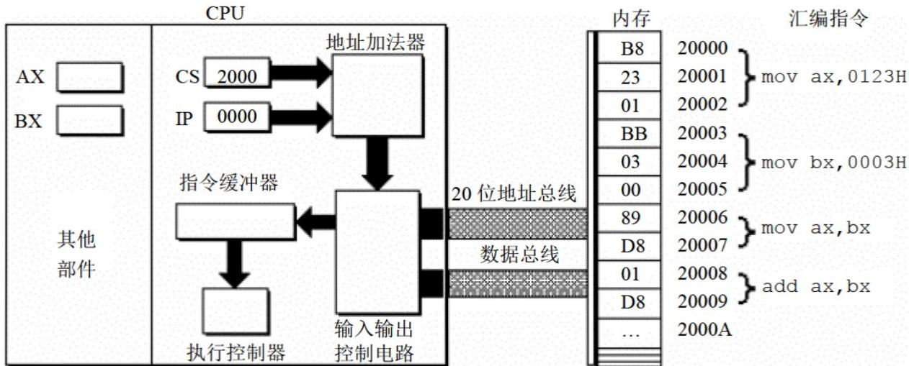
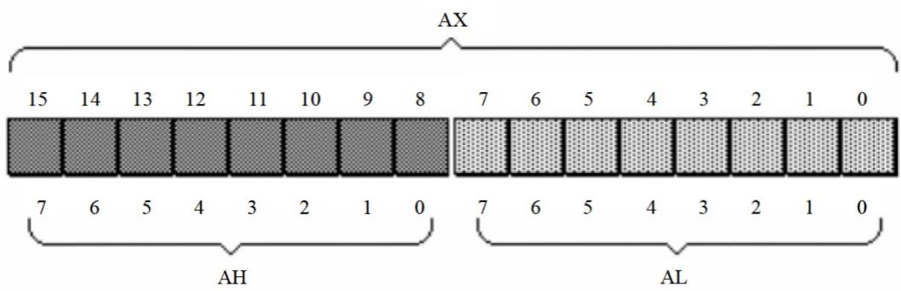

<!-- 由 scripts/sync-obsidian.mjs 自动生成，请勿直接编辑。 -->

> 本教程整理自《汇编语言（第 4 版）》第 25–58 页。
>
> 面向有 Java 基础、但刚开始学习 8086 汇编的读者。以**一个完整程序的运行过程为主线**，CPU 执行到哪，概念就讲到哪。

# 🎯 学完这份教程，你应该能做什么

- 说清楚 AX、AH、AL、BX、CS、IP 等寄存器的基本作用；
- 区分 bit、byte、word，以及 8 位和 16 位运算；
- 把 `mov`、`add`、`jmp` 看成对寄存器和执行位置的具体操作；
- 用 `段地址:偏移地址` 和公式计算 8086 的物理地址；
- 解释 CPU 如何通过 `CS:IP` 找到并执行下一条指令；
- 读懂 Debug 中寄存器、内存、机器码和汇编指令之间的对应关系。

优秀b站讲解
[计算机组成原理-透视版](https://www.bilibili.com/video/BV1edBKYVEwo?spm_id_from=333.788.videopod.sections&vd_source=a41cd2a53e509e4e0f74559bf48d2468)

# 🏃 起点：一个完整的 8086 程序

先看一个最简单的汇编程序——计算 3 + 2：

```asm
data segment             ; ① 声明数据段：存放程序使用的数据
    num db 3             ;   定义一个字节变量 num，初始值为 3
data ends

code segment             ; ② 声明代码段：存放 CPU 要执行的指令

start:                   ; ③ 程序入口
    mov ax, data         ; ④ AX ← 数据段地址
    mov ds, ax           ; ⑤ DS ← 数据段地址，此后可以访问 num
    mov al, num          ; ⑥ AL ← 3（从内存读取变量 num）
    add al, 2            ; ⑦ AL ← 3 + 2 = 5
    mov ax, 4c00h        ; ⑧ 准备退出：AH=4Ch, AL=00h
    int 21h              ; ⑨ 调用 DOS，结束程序

code ends

end start                ; ⑩ 告诉汇编器：入口是 start
```

8086有一条硬件限制

> 不能把一个立即数或段地址直接写进 `DS`，只能先装进普通寄存器（如 `AX`、`BX`），再复制给 `DS`。

CPU 的执行流程如下（这就是本教程的路线图）：

```asm
    CPU 被操作系统加载，CS:IP 指向 start ──→ 第一步
    ↓
mov ax, data    ──→ 第二步（认识寄存器）
    ↓
mov ds, ax      ──→ 第三步（段地址 × 16 + 偏移地址）
    ↓
mov al, num     ──→ 第四步（8 位寄存器与内存读取）
    ↓
add al, 2       ──→ 第五步（加法指令与操作数规则）
    ↓
mov ax, 4c00h   ──→ 第六步（16 位写入覆盖整个 AX）
    ↓
int 21h         ──→ 第七步（程序退出）
    ↓
（回头看：哪些是伪指令？）
```

> [!TIP]
> 把上面这个流程图看作地图。每一节都会回到这个程序，解释 CPU 在执行到这一步时发生了什么。

---

# ⚙️ 第一步：CPU 从哪里开始执行？—— CS:IP 与取指循环

![[images/01-取指执行循环.png]]

> CS:IP 指向下一条指令，CPU 依次完成取指、执行，再让 IP 前进。

在第一条 `mov` 执行之前，CPU 必须先知道**第一条指令放在内存的哪个位置**。

## 先快速理解 CPU 是什么

一个典型 CPU 可以粗略看成四类部件：

| 部件 | 作用 | 类比 Java |
|---|---|---|
| 运算器 | 做加法、减法等信息处理 | 执行 `+`、`-` 等运算的部分 |
| 控制器 | 决定下一步做什么 | 解释并调度指令的部分 |
| 寄存器 | 保存 CPU 当前正在使用的数据 | CPU 内部的一组高速变量 |
| 内部总线 | 在部件之间传送数据 | 部件之间的数据通道 |

对汇编程序员来说，**寄存器**最重要。程序员通过指令读写寄存器来控制 CPU：

```text
执行指令 → 改变寄存器内容 → 影响 CPU 后续行为
```

8086 一共有 14 个寄存器：

```text
AX BX CX DX SI DI SP BP IP CS SS DS ES PSW
```

本教程重点使用 AX、BX、CX、DX、CS 和 IP。

## CS:IP —— CPU 的"当前读到哪了"

CPU 怎么知道下一步该执行哪条指令？答案在 **CS** 和 **IP** 这一对寄存器中：

- **CS**（Code Segment）：保存代码段的段地址；
- **IP**（Instruction Pointer）：保存当前指令在代码段内的偏移地址。

任意时刻，CPU 都把 `CS:IP` 指向的内存内容**当作指令来执行**。



## 取指 → 增 IP → 执行：CPU 的核心循环

CPU 执行指令可以抽象成五个步骤的无限循环：

```text
1. 根据 CS:IP 计算指令的物理地址
2. 从内存读取机器码
3. IP 增加当前指令的长度（准备好指向下一条）
4. 执行这条指令
5. 回到第 1 步
```

举个例子：

```text
CS = 2000H
IP = 0000H
物理地址 = 2000H × 16 + 0000H = 20000H
```

如果 `20000H` 处的机器码是 `B8 23 01`，它对应的汇编指令是：

> [!columns-1-1]
> > [!plain]
> > ```text
> > B8 23 01
> > ```
>
> > [!plain]
> > ```asm
> > mov ax,0123H
> > ```

这条指令长度为 **3 字节**，所以 CPU 取指后：`IP = 0000H + 3 = 0003H`。

然后 CPU 执行这条 `mov ax,0123H`，接着从 `2000:0003` 读取下一条指令。

## IP 每次增加多少？取决于指令长度

不同的指令占用的字节数不同：

| 地址 | 机器码 | 汇编指令 | 长度 |
|---|---|---|---:|
| `20000H–20002H` | `B8 23 01` | `mov ax,0123H` | 3 字节 |
| `20003H–20005H` | `BB 03 00` | `mov bx,0003H` | 3 字节 |
| `20006H–20007H` | `89 D8` | `mov ax,bx` | 2 字节 |
| `20008H–20009H` | `01 D8` | `add ax,bx` | 2 字节 |

**IP 不是每次固定加 1，而是增加"刚刚读取的指令字节数"。**

> [!TIP]
> 读指令执行过程时，可以像调试 Java 程序一样维护一个状态表：每执行一条指令，就记录 AX、BX、CS、IP 的新值。区别在于，IP 的变化量取决于机器指令的字节长度。

## CPU 如何区分数据和指令？

![[images/02-指令与数据.png]]

> 字节本身不携带“我是指令还是数据”的解释，真正决定含义的是 CPU 的访问方式。

内存中的二进制本身没有标签标明“这是数据”或“这是指令”。

同一段二进制信息：

- 由 `CS:IP` 指向时，CPU 按“指令”解释；
- 被 `mov al, num` 这类指令访问时，CPU 按“数据”解释。

> [!NOTE]
> “代码”和“数据”在内存中都只是二进制。解释方式由“谁指向它”决定——`CS:IP` 指向的就是指令，其他方式访问的就是数据。

## 代码段：一段被当作指令的内存

假设从物理地址 `123B0H` 开始，连续存放了10个字节的指令：

```asm
mov ax,0000
add ax,0123H
mov bx,ax
jmp bx
```

程序员可以声明 `123B0H–123B9H` 为代码段：

```text
段地址 = 123BH
偏移   = 0000H
```

但 CPU 不会自动执行它。必须让 `CS:IP` 指向首地址：

```text
CS = 123BH
IP = 0000H
```

---

**回到我们的程序。** 当操作系统加载程序后，`CS:IP` 被设置为指向 `start:` 标记的位置。CPU 的取指循环开始运转，第一条指令 `mov ax, data` 被读取……

---

# 🧠 第二步：`mov ax, data` —— 认识通用寄存器

CPU 遇到的第一条指令是 `mov ax, data`。要理解它，先要认识 AX 和 `data` 是什么。

## AX、BX、CX、DX：四个通用寄存器

8086 的寄存器都是 **16 位**，可以保存两个字节。AX、BX、CX、DX 用于保存一般数据，称为**通用寄存器**。

可以把 `mov` 先理解为 Java 的赋值：

> [!columns-1-1]
> > [!plain]
> > ```asm
> > mov ax, 18
> > ```
>
> > [!plain]
> > ```java
> > ax = 18;
> > ```

`mov` 是"复制"而不是"移动"——源操作数不会被清空。执行 `mov ax, bx` 后，BX 仍然保持原值。

> [!NOTE]
> `mov` 的"传送"更接近 Java 的赋值：它把源操作数的值复制到目的操作数，不会把源操作数清空。

## 那 `data` 是什么？

`data` 是程序员给**数据段**起的名字。在程序开头：

```asm
data segment
    num db 3
data ends
```

`data segment ... data ends` 声明了一段内存区域，里面放了一个变量 `num`。

当汇编器处理 `mov ax, data` 时，它会把 `data` 替换成这个数据段的**段地址**（一个 16 位数）。所以这条指令的实际效果是：

```text
AX ← 数据段的段地址（一个 16 位数值）
```

这个段地址是汇编器和操作系统在加载程序时确定的，程序员不需要手动计算。

> [!NOTE]
> 汇编指令通常写成 `指令 目的操作数, 源操作数` 的格式。`mov ax, data` 的意思是"把 `data` 的值复制到 AX"。

---

**继续执行：** AX 现在保存了数据段的段地址。但 CPU 还不能访问变量 `num`——还需要把这个地址告诉 DS 寄存器。

---

# 📐 第三步：`mov ds, ax` —— 段地址 × 16 + 偏移地址

![[images/03-数据段初始化.png]]

> 段寄存器初始化的典型路径是：先把数据段地址放入 AX，再装入 DS。

CPU 执行 `mov ds, ax`，把 AX 中的值复制到 **DS**（Data Segment）寄存器。为什么要多此一举？

## 8086 的寻址困境

- 8086 有 **20 根地址总线**，能表示 20 位地址 → 可访问 $2^{20} = 1\,\mathrm{MB}$ 内存；
- 但 8086 是 **16 位结构**，内部寄存器都是 16 位 → 一个寄存器最多表示 **64KB**。

**矛盾**：CPU 内部只能处理 16 位地址，但需要访问 20 位的物理地址空间。

**解决方案**：用两个 16 位数合成一个 20 位物理地址。

## 核心公式

![[images/04-段地址与偏移.png]]

> 8086 使用“段地址 × 16 + 偏移”得到物理地址，同一个物理地址可能有多个段:偏移表示法。

```text
物理地址 = 段地址 × 16 + 偏移地址
```

例如：

```text
段地址   = 1000H
偏移地址 = 0020H

物理地址 = 1000H × 16 + 0020H
         = 10000H + 0020H
         = 10020H
```

写作 `1000:0020`，这就是 8086 的**段地址:偏移地址**表示法。

## 为什么是 ×16？

十六进制每一位对应四个二进制位。**×16 等价于二进制左移 4 位**（也就是十六进制左移 1 位）：

```text
1000H × 16 = 10000H    （末尾多一个 0）
```

CPU 内部的地址加法器就是：把段地址左移 4 位，再加上偏移地址。不需要乘法电路。

## DS：数据段寄存器

回到我们的程序——CPU 现在需要准备好访问数据。8086 约定：

- 访问数据时，段地址默认来自 **DS** 寄存器；
- 偏移地址由指令中的变量名（如 `num`）提供。

所以 `mov ds, ax` 的意思是：**"把数据段的段地址告诉 DS，后面用 DS 来找变量。"**

这就像 Java 中先拿到一个对象的引用，然后才能访问它的字段：

```java
DataSegment ds = new DataSegment();  // mov ax, data + mov ds, ax
int x = ds.num;                      // mov al, num
```

## 同一个物理地址可以有多个表示

段地址和偏移地址的组合不是唯一的：

```text
2000H × 16 + 1F60H = 21F60H
2100H × 16 + 0F60H = 21F60H
21F0H × 16 + 0060H = 21F60H
21F6H × 16 + 0000H = 21F60H
```

这说明**"段"不是硬件提前切好的固定分区**，而是程序员用两个数组合出的寻址方式。

> [!WARNING]
> 不要把"段"理解成硬件提前划好的内存分区。8086 提供的是一种寻址方式，程序员可以根据需要把一段连续地址看作代码段、数据段或其他用途的段。

## 段的两个限制

- 段地址 ×16 后一定是 16 的倍数 → **段的起始物理地址一定是 16 的倍数**；
- 偏移地址是 16 位 → **一个段最多覆盖 64KB**。

---

**继续执行：** DS 已经指向数据段。CPU 现在可以读取变量 `num` 了。

---

# 💾 第四步：`mov al, num` —— 8 位寄存器与内存读取

CPU 执行 `mov al, num`。这里出现了两个新东西：AL（不是 AX）和 `num`（内存中的变量）。

## AX 可以拆成 AH 和 AL

![[images/05-位宽与寄存器.png]]

> AX 是 16 位寄存器，AH 和 AL 各占 8 位；`byte` 与 `word` 必须和操作数位宽匹配。

8086 的 16 位通用寄存器可以拆成两个独立的 8 位寄存器来使用：

```asm
AX = AH（高 8 位） + AL（低 8 位）
BX = BH + BL
CX = CH + CL
DX = DH + DL
```

原书图 2.3 和图 2.4 展示了这种对应关系：



例如，若 `AX = 4E20H`，那么：

> [!columns-1-1]
> > [!plain]
> > `AH = 4EH`
>
> > [!plain]
> > `AL = 20H`

> [!TIP]
> 可以把 AX 暂时类比成一个 `short`，把 AH 和 AL 类比成它的高 8 位和低 8 位。但 AH、AL 的修改会直接影响 AX 的二进制内容——它们不是三个互不相关的变量。

## 为什么要用 AL 而不是 AX？

两个原因：

1. **兼容前代 8080/8085**：8086 的前身是 8 位 CPU，寄存器全是 8 位的。8086 把 16 位寄存器拆成两半，老代码稍改就能移植。
2. **节省硬件**：不拆分的话，存一个字符也要占满 16 位，浪费一半。拆开后 4 个 16 位寄存器等效 8 个 8 位的，硬件成本为零。

 `num db 3` 定义的是一个<span class="byte-term">字节（byte）</span>变量，只占 8 位。AL 也是 8 位——**位数要匹配**。

## byte 和 word

8086 主要处理两种尺寸的数据：

| 名称 | 大小 | 常见存放位置 |
|---|---:|---|
| byte（字节） | 8 bit | 8 位寄存器，或一个内存单元 |
| word（字） | 16 bit | 16 位寄存器，或两个连续内存单元 |

一个 word 由高位字节和低位字节组成：

```text
4E20H
低位字节 = 20H
高位字节 = 4EH
```

在 AX 中，`AH` 保存高位字节，`AL` 保存低位字节。

## 一个寄存器能保存多大的数

无符号数的最大值由位数决定：

```text
8 位最大值  = 2^8  - 1 = 255  = FFH
16 位最大值 = 2^16 - 1 = 65535 = FFFFH
```

因此：
- 8 位寄存器不能保存 `100H` 这样超过 8 位范围的数；
- 16 位寄存器最多保存 4 位十六进制数；
- 计算结果超过寄存器容量时，低位保留，高位进位丢弃。

> [!WARNING]
> 判断一条指令是否合法时，先检查数值能否放入目标寄存器：8 位最多 `FFH`，16 位最多 `FFFFH`。

## CPU 如何从内存找到 `num`？

当 CPU 执行 `mov al, num` 时：

1. 段地址来自 **DS**（数据段寄存器，第③步设置的）；
2. 偏移地址由汇编器计算——`num` 是数据段中的第一个变量，偏移地址为 **0**；
3. 物理地址 = DS × 16 + 0，CPU 从这个地址读出一个字节；
4. 这个字节的值是 `3`，放入 AL。

所以 `mov al, num` 的实际效果是：**AL ← 3**。

## 附：三种数制速查

计算机内部使用二进制，但十六进制更容易观察字节边界。一个十六进制数字正好对应四个二进制位：

```text
0100 1110 0010 0000B
  4    E    2    0
```

本教程采用以下后缀区分进制：

```text
十进制：20000
十六进制：4E20H
二进制：0100111000100000B
```

---

**继续执行：** AL 中现在是 3。下一步就是计算 3 + 2。

---

# ➕ 第五步：`add al, 2` —— 加法指令与操作数规则

CPU 执行 `add al, 2`。这是本程序唯一的"计算"指令。

## add：结果写回第一个操作数

> [!columns-1-2]
> > [!plain]
> > ```asm
> > add ax, 8
> > ```
> >
> > ```asm
> > add ax, bx
> > ```
>
> > [!plain]
> > ```java
> > ax = ax + 8;
> > ax = ax + bx;
> > ```

两条 `add` 指令都把结果写回**第一个操作数**，第二个操作数不会被修改。

在本程序中：

```text
执行前：AL = 3
执行 add al, 2 后：AL = 3 + 2 = 5
```

## 操作数位数必须一致

合法示例：

```asm
mov ax, bx       ; 16位 ← 16位 ✓
mov al, 18H      ; 8位 ← 8位 ✓
add ax, 20000    ; 16位 ← 16位 ✓
```

非法示例：

```asm
mov ax, bl       ; 16位 ← 8位  ✗ 位数不匹配
mov bh, ax       ; 8位 ← 16位  ✗ 位数不匹配
mov al, 20000    ; 8位 ← 超范围 ✗ 20000 > 255
add al, 100H     ; 8位 ← 9位   ✗ 100H > FFH
```

判断指令时，先问两个问题：

1. 目的操作数是 8 位还是 16 位？
2. 源操作数的位数和值是否匹配？

> [!WARNING]
> `AX` 是 16 位，`AL` 和 `BL` 是 8 位，不能直接把它们混用在同一条数据传送或运算指令中。

## 8 位运算不会自动升级成 16 位

> **操作 `AL` 时，CPU只计算 `AL`这8位；装不下的部分放进 `CF`，不会跑到 `AH`。**
> 
> `add al` → 8位运算，AH 不参与
> `add ax` → 16位运算，AH 和 AL 共同组成结果
> 溢出的进位 → **CF**

![[images/06-八位运算与溢出.png]]

> `add al, 2` 只在 8 位范围内写回 AL，超出的进位会离开结果并影响进位标志 **CF**。

假设 `AX = 00C5H`，执行 `add al, 93H`：

> [!plain]
> 计算：`C5H + 93H = 158H`
>
> 结果：AL 只能保留低 8 位，因此 AX 变成 `0058H`。

**CPU 不会因为 AL 溢出，就把进位自动写进 AH。** 只有明确使用 AX 做 16 位运算时，AH 才属于这个 16 位结果的一部分。

一个极端的例子——AL 存满 **FFH（十进制，255）**，再加 1：

```asm
AL = FFH
add al, 1
→ AL = 00H   （低 8 位回绕到 0）
→ CF = 1     （进位被捕获到标志寄存器 CF）
→ AH 不变
```

对比 16 位：AX 全满（`FFFFH`，即十进制 **65535**）再加 1，同样回绕：

```asm
AX = FFFFH      （65535，16 位最大值）
add ax, 1
→ AX = 0000H    （回绕到 0）
→ CF = 1
```

8 位运算和 16 位运算是隔离开的——溢出都不会自动"升级"到更宽的寄存器，进位只影响标志位。

### CF 在哪？

8086 有一个 16 位的 **FLAGS** 寄存器，内部拆成多个 1 位的状态位：

```text
FLAGS
├── CF   进位标志（Carry Flag）
├── ZF   零标志（结果是否为 0）
├── SF   符号标志（结果最高位是否为 1）
├── OF   溢出标志（有符号数是否溢出）
└── ...  其他标志
```

CF 只占 **1 位**，所以只能是：

```text
CF = 0  →  没有进位
CF = 1  →  产生了进位
```

后续条件跳转指令（如 `jc`、`jnc`）就是靠检查这一位来决定是否跳转的。

> [!WARNING]
> `add al, 93H` 是 8 位运算，不能把它理解成"先算 AX，再把结果拆回 AH 和 AL"。只有 `add ax, ...` 才会把整个 AX 当作一个 16 位操作数。

## 典型执行过程（附完整追踪表）

用下面这段指令来感受一下 `mov` 和 `add` 的完整执行过程：

初始：

```text
AX = 0000H
BX = 0000H
```

执行：

```asm
mov ax, 4E20H
add ax, 1406H
mov bx, 2000H
add ax, bx
mov bx, ax
```

每一步的寄存器状态：

| 指令 | AX | BX |
|---|---:|---:|
| `mov ax, 4E20H` | `4E20H` | `0000H` |
| `add ax, 1406H` | `6226H` | `0000H` |
| `mov bx, 2000H` | `6226H` | `2000H` |
| `add ax, bx` | `8226H` | `2000H` |
| `mov bx, ax` | `8226H` | `8226H` |

如果再执行 `add ax, bx`，计算结果是 `1044CH`，但 AX 只有 16 位，最终 AX 只能保留 `044CH`。最高位的 `1` 是进位——后续学习标志寄存器时再讨论。

---

**继续执行：** AL 现在是 5。但接下来 CPU 要做一件"奇怪"的事。

---

# 📦 第六步：`mov ax, 4c00h` —— 16 位写入覆盖整个 AX

CPU 执行 `mov ax, 4c00h`。注意：这里写的是 AX（16 位），而不是 AL（8 位）。

## 写入 AX 会同时覆盖 AH 和 AL

因为 AX = AH + AL 是同一个物理寄存器的两种视角：

```text
执行前：AX = ??05H  （AL=05H，AH 是某个值）
执行 mov ax, 4c00h 后：
    AH = 4Ch
    AL = 00h
```

**AL 中原来的计算结果 5 被覆盖了。** 如果你需要在退出前保留这个值，应该把它存到另一个寄存器或内存中。

## AH 和 AL 的关系总结

- 读写 AX（16 位）时，AH 和 AL 同时改变；
- 读写 AH 或 AL（8 位）时，只改变对应的那一半，另一半不变；
- AH 和 AL 不是三个独立变量，而是同一个 16 位存储空间的不同“窗口”。

---

**继续执行：** AX 现在是 `4C00h`。CPU 准备退出程序。

---

# 🚪 第七步：`int 21h` —— 让 DOS 结束程序

![[images/07-程序退出.png]]

> `mov ax, 4c00h` 准备退出功能号，再通过 `int 21h` 请求 DOS 接管程序结束流程。

CPU 执行 `int 21h`。`int` 是 **interrupt（中断）** 的缩写。

## 什么是中断？

可以理解为：CPU 暂停当前程序，把控制权交给操作系统，让操作系统帮你做一件事。

`int 21h` 是 DOS 系统的服务入口。CPU 会根据 AH 中的值决定执行哪个功能：

```text
AH = 4Ch  →  "结束当前程序，返回操作系统"
AL = 00h  →  退出码（0 表示正常退出）
```

所以 `mov ax, 4c00h` + `int 21h` 这个组合就是 8086 DOS 程序的"标准退出方式"。

> [!NOTE]
> 中断的完整机制比较复杂（涉及中断向量表、标志寄存器入栈等），现阶段只需要知道：`AH=4Ch + int 21h = 程序结束`。

---

# 🔄 回头看：哪些是 CPU 指令，哪些是伪指令？

![[images/08-伪指令与机器指令.png]]

> 伪指令帮助汇编器组织和翻译源程序，CPU 最终真正执行的是汇编器生成的机器指令。

程序执行完毕，回头审视整个源文件。一个最容易混淆的点是：

| 内容 | 类别 | CPU 会执行吗？ |
|---|---|---|
| `data segment` | 汇编伪指令 | ❌ 不执行 |
| `num db 3` | 汇编伪指令 | ❌ 不执行 |
| `data ends` | 汇编伪指令 | ❌ 不执行 |
| `code segment` | 汇编伪指令 | ❌ 不执行 |
| `start:` | 标号 | ❌ 不执行（只标记位置） |
| `mov ax, data` | **CPU 指令** | ✅ 执行 |
| `mov ds, ax` | **CPU 指令** | ✅ 执行 |
| `mov al, num` | **CPU 指令** | ✅ 执行 |
| `add al, 2` | **CPU 指令** | ✅ 执行 |
| `mov ax, 4c00h` | **CPU 指令** | ✅ 执行 |
| `int 21h` | **CPU 指令** | ✅ 执行 |
| `code ends` | 汇编伪指令 | ❌ 不执行 |
| `end start` | 汇编伪指令 | ❌ 不执行 |

**汇编伪指令**是写给汇编器（MASM/TASM 等）看的，告诉汇编器：
- 内存怎么布局（`data segment` / `code segment`）；
- 变量定义在哪，初始值是什么（`num db 3`）；
- 程序入口在哪里（`end start`）。

它们会被汇编器"消化"掉，**不会生成机器码**。真正变成机器码、被 CPU 一条条执行的，只有 `mov`、`add`、`int` 这些指令。

---

# 🔀 补充：`jmp` —— 改变执行路径

目前为止，CPU 都是顺序执行指令（IP 自动增加）。`jmp` 指令可以**跳转**到任意位置。

## 同时修改 CS 和 IP（远跳转）

执行指令：`jmp 2AE3:0003`

**执行后：**

```text
CS = 2AE3H
IP = 0003H
```

下一条指令的物理地址：`2AE3H × 16 + 0003H = 2AE33H`

## 只修改 IP（近跳转）

执行指令：`jmp ax`

::::columns
:::column
**执行前：**

```asm
AX = 1000H
CS = 2000H
IP = 0003H
```
:::
:::column
**执行后：**

```asm
AX = 1000H
CS = 2000H
IP = 1000H
```
:::
::::

可以把它理解为 `IP = AX`。

> [!WARNING]
> "`IP = AX`" 只是帮助理解的类比。8086 **不允许**用 `mov` 直接修改 IP，改变执行位置必须使用 `jmp` 等转移指令。

---

# 🐞 Debug：观察 CPU 一步步执行

> [!WARNING]
> 本节是 How-to 内容。原书介绍的是 DOS/Windows 时代的 Debug 工具；现代系统通常不能直接按原书环境运行它。本节重点是理解命令分别观察 CPU 的哪一部分。

## 六个核心命令

| 命令 | 用途 | 观察对象 |
|---|---|---|
| `R` | 查看或修改寄存器 | AX、BX、CS、IP 等 |
| `D` | 查看内存 | 内存中的字节和 ASCII |
| `E` | 修改内存 | 数据、字符或机器码 |
| `U` | 反汇编 | 机器码对应的汇编指令 |
| `T` | 单步执行 | `CS:IP` 指向的指令及寄存器变化 |
| `A` | 写入汇编指令 | 由 Debug 翻译并写入机器码 |

## R：查看和修改寄存器

直接输入 `R` 可以查看寄存器。重点观察 `CS:IP`，它表示 CPU 当前准备读取的指令位置。

修改 AX：输入 `R AX`，然后输入新的十六进制值。

## D：查看内存

查看 `10000H`，可以使用 `D 1000:0`，因为 `1000H × 16 + 0000H = 10000H`。

指定查看范围：`D 1000:0 9` 表示查看 `1000:0` 到 `1000:9`。Debug 通常显示：

1. 内存地址；
2. 十六进制字节；
3. 对应的 ASCII 字符。

## E：修改内存

一次写入多个字节：`E 1000:0 01 02 03 04`，从 `1000:0` 开始依次写入四个字节。

也可以交互式操作：`E 1000:10`，输入数据后按空格处理当前单元，按 Enter 结束。

E 命令写入的可以是数值、字符、字符串或机器码——内存不区分这些，区别来自后续如何解释。

## U：把机器码翻译成汇编

如果从 `1000:0` 写入了 `E 1000:0 B8 01 00 B9 02 00 01 C8`，使用 `U 1000:0` 可以看到：

```asm
mov ax, 1
mov cx, 2
add ax, cx
```

> [!NOTE]
> `D` 和 `U` 并没有改变内存内容，只是采用了不同的解释方式：D 按字节显示，U 按机器指令边界反汇编。

## T：单步执行

T 命令执行 `CS:IP` 当前指向的指令。执行后重点观察：

- AX、BX 等寄存器是否改变；
- IP 增加了多少；
- 下一条 `CS:IP` 指向哪里。

例如执行 `mov ax, 0001` 后，AX 变成 `0001H`，IP 增加 3（该指令占 3 字节）。

> [!TIP]
> 用 T 单步时，先看执行前的 `CS:IP`，再看执行后的寄存器变化。这样可以把"取指位置"和"指令产生的效果"分开理解。

## A：直接写入汇编指令

相比用 E 命令手动输入机器码，A 命令更接近写汇编程序。输入 `A 1000:0`，然后：

```asm
mov ax, 1
mov cx, 2
add ax, cx
```

Debug 会将这些汇编指令翻译成机器码写入内存。输入空行结束。

---

# 💾 补充：内存中字的存储

内存的基本存储单元是一个字节。一个 word 有 16 位、两个字节，因此需要占用**两个连续的内存单元**。

8086 采用**小端序**：低位字节放在低地址，高位字节放在高地址。

```text
4E20H
低位字节 = 20H
高位字节 = 4EH
```

从地址 0 开始存放时：

| 内存地址 | 内容 |
|---:|---:|
| 0 | `20H` |
| 1 | `4EH` |

地址 0 和地址 1 合起来可以看作"0 地址字单元"。

> [!NOTE]
> "低地址放低位字节"是理解 8086 内存数据的关键。读取一个 word 时，把低地址中的字节看作低 8 位、高地址中的字节看作高 8 位，再组合成 16 位数。

---

# 🧪 动手练习

## 练习一：跟踪 8 位和 16 位混合运算

```asm
mov ax, 001AH
mov bx, 0026H
add al, bl
add ah, bl
add bh, al
mov ah, 0
add al, 85H
```

建议每执行一条指令就记录：

| 步骤 | 指令 | AX | BX | 说明 |
|---:|---|---|---|---|
| 1 | `mov ax, 001AH` | `001AH` | — | AX 整体赋值 |
| 2 | `mov bx, 0026H` | `001AH` | `0026H` | BX 整体赋值 |
| 3 | `add al, bl` | 只改变 AL | `0026H` | 8 位运算 |
| 4 | `add ah, bl` | 只改变 AH | `0026H` | 8 位运算 |
| 5 | `add bh, al` | 不变 | 只改变 BH | 8 位运算 |

每一步都先确定**操作数的位数**，再更新对应寄存器部分。

## 练习二：手算 mov 和 add 序列

给定 `AX = 0000H, BX = 0000H`，依次执行：

```asm
mov ax, 4E20H
add ax, 1406H
mov bx, 2000H
add ax, bx
mov bx, ax
add ax, bx
```

记录每一步后 AX 和 BX 的值。最后一条 `add ax, bx` 的结果是多少？为什么？

## 练习三：计算物理地址

1. 段地址 = `2000H`，偏移地址 = `1F60H` → 物理地址 = ?
2. 给出同一个物理地址的另一组段地址:偏移地址表示。
3. `add ax, ax` 连续执行 4 次，结果是什么？

## 练习四：追踪 CS:IP

设 `CS = 2000H, IP = 0000H`，内存中有以下机器码：

| 地址 | 机器码 | 指令 | 长度 |
|---|---|---|---|
| `20000H` | `B8 23 01` | `mov ax, 0123H` | 3 |
| `20003H` | `BB 03 00` | `mov bx, 0003H` | 3 |
| `20006H` | `89 D8` | `mov ax, bx` | 2 |
| `20008H` | `01 D8` | `add ax, bx` | 2 |

写出每条指令执行后的 IP 值。

---

如果某一步算不出来，优先回到三条基础规则：

```text
寄存器有位数限制
物理地址 = 段地址 × 16 + 偏移地址
CPU 执行 CS:IP 指向的内容
```

---

# 📚 核心复习表

## 寄存器

| 寄存器 | 作用 |
|---|---|
| AX、BX、CX、DX | 通用数据寄存器 |
| AH、AL | AX 的高 8 位和低 8 位 |
| CS | 当前代码段地址 |
| IP | 当前指令的偏移地址 |
| DS | 当前数据段地址 |
| CS:IP | CPU 当前要读取的指令位置 |

## 地址

| 关系 | 表达式 |
|---|---|
| 物理地址 | `段地址 × 16 + 偏移地址` |
| 段地址换算 | `段地址 × 16 = 段地址左移 4 位` |

## 指令

| 指令 | 直观含义 |
|---|---|
| `mov ax, bx` | `AX = BX` |
| `add ax, bx` | `AX = AX + BX` |
| `jmp ax` | `IP = AX` |
| `jmp 2000:0003` | `CS = 2000H`，`IP = 0003H` |
| `int 21h`（AH=4Ch） | 退出程序 |

## 读汇编示例的固定步骤

看到一条指令时，按以下顺序分析：

1. 目的操作数是谁？
2. 源操作数是谁？
3. 两个操作数分别是 8 位还是 16 位？
4. 执行后哪些寄存器部分会改变？
5. 如果是跳转指令，CS 或 IP 会变成什么？
6. 如果涉及内存，使用段地址和偏移地址算出物理地址。

---

# ❓ Q&A

## 为什么 8 位最大值是 FFH？

十六进制中的单个 `F` 代表 **15**，不是 16。

十六进制一共有 16 个数字：

```text
十六进制：0 1 2 3 4 5 6 7 8 9 A  B  C  D  E  F
十进制：  0 1 2 3 4 5 6 7 8 9 10 11 12 13 14 15
```

所以 `F = 15`。之所以叫"十六进制"，是因为它总共有 16 种数字，数到 `F` 后才进位：

```text
FH  = 十进制 15
10H = 十进制 16
```

一个十六进制位能表示 4 个二进制位（`F = 1111B`），两个十六进制位就是 8 个二进制位：

```text
FFH = 1111 1111B
```

AL 刚好是 8 位，所以它的无符号最大值按位权算就是：

```text
FFH
││
│└── 右边 F：15 × 16⁰ =  15
└──  左边 F：15 × 16¹ = 240

240 + 15 = 255
```

> 这就是**任意进制转十进制的通用算法**（位权展开求和）。十进制我们从小算习惯了所以不觉得——`255` 本质上也是 `2×10² + 5×10¹ + 5×10⁰`，只是看到"255"就直接读出来了，不用刻意展开。

再加 1：

```text
 FFH
+ 01H
────
100H     （需要 9 个二进制位：1 0000 0000B）
```

AL 只有 8 位，只能保留后 8 位 → `AL = 00H`，进位进到 `CF = 1`。

最容易记：

```text
二进制最大单个数字：1，下一位是 10
十进制最大单个数字：9，下一位是 10
十六进制最大单个数字：F，下一位是 10H
```

> **F 代表 15；16 在十六进制中写作 10H。**

## 数字超过 16 位怎么办？CF是什么？

**无论数字多大，都可以拆成 CPU 支持的若干段，从最低位开始逐段相加，用 CF 把进位传给下一段。** 
**这就是大整数运算的底层基础。**

```
CPU位数有限
→ 大数分段
→ 低位先加
→ CF传递进位
→ ADC继续计算高位
→ 实现任意精度运算
```

数字不超过 16 位时：AX 保存结果的低 16 位，CF 作为第 17 位。

```asm
mov ax, FFFFH
add ax, 1
→ AX = 0000H  （低 16 位）
→ CF = 1      （第 17 位）
```

数字超过 16 位时：拆成多个 16 位部分，从低位向高位逐段相加，用 **ADC** 加上前一段的进位。

```asm
; 计算 1_0000_0000H（33 位）拆成两个 16 位
mov ax, 0000H    ; 低 16 位
mov dx, 0001H    ; 高 16 位  → 整体值 = DX:AX = 1_0000_0000H
```

关键理解：CF 的 `1` 不是结果"加 1"，而是代表**更高一位**。在 16 位运算中，这个 1 的实际权重是 **65536**（即 $2^{16}$）：

```text
AX = 0000H  +  CF = 1  =  0 + 65536  =  65536
```

ADC 就是 `add + CF`，专为多段加法设计：

```asm
add ax, bx     ; 低位段相加，溢出进 CF
adc dx, cx     ; 高位段相加，同时加上 CF（低段的进位）
```

## 实例：两个 64 位整数相加

8086 一次最多处理 16 位，所以把每个 64 位数拆成 4 段：

```text
第一个 64 位数 A：

A₄       A₃       A₂       A₁
高 16 位                    低 16 位

第二个 64 位数 B：

B₄       B₃       B₂       B₁
高 16 位                    低 16 位
```

对应位置相加：

```text
       A₄       A₃       A₂       A₁
+      B₄       B₃       B₂       B₁
──────────────────────────────────────
       R₄       R₃       R₂       R₁
```

从最右侧的最低 16 位开始：

```text
① A₁ + B₁        → 得到 R₁，进位放入 CF
② A₂ + B₂ + CF   → 得到 R₂，更新 CF
③ A₃ + B₃ + CF   → 得到 R₃，更新 CF
④ A₄ + B₄ + CF   → 得到 R₄，更新最终 CF
```

汇编指令模式`add` `adc`：

```asm
add  A1, B1       ; 最低 16 位
adc  A2, B2       ; 第二段 + CF
adc  A3, B3       ; 第三段 + CF
adc  A4, B4       ; 最高段 + CF
```

如果最后 `CF = 0`，结果能装进 64 位：

```text
R₄ R₃ R₂ R₁
```

如果最后 `CF = 1`，结果需要 65 位：

```text
1 R₄ R₃ R₂ R₁
↑
最终 CF
```

所以：**两个 64 位数相加，最大可能产生 65 位结果。**

这和 `11 + 11 = 110` 完全是同一种原理——只是每次处理的位数不同：

```text
11 + 11     → 每次处理 1 位
64 位大数   → 8086 每次处理 16 位
```

本质都是：**从最低位开始，对应部分相加，并把进位传递到更高部分。**

## DW 是什么？8086 数据段上限是多少？

**`DW`（Define Word）用于在内存中定义一个或多个 16 位数据。**

```text
1 个 DW = 16 位 = 2 字节
```

例如：

```asm
num dw 1234H
```

表示分配一个 16 位空间，初始值为 `1234H`。

多个 `DW` 可以组合成大整数：

```asm
num dw 4 dup(0)
```

表示 `4 × 16 位 = 64 位` 的空间。

8086 的一个数据段最大是 **64KB**：

```text
64KB = 65536 字节
```

一个 `DW` 占 2 字节，因此一个数据段理论上最多容纳：

```text
65536 ÷ 2 = 32768 个 Word
```

如果将它们全部组合成一个大整数，最多可以表示：

```text
32768 × 16 = 524288 位
```

需要注意：

> **单个 `DW` 永远只有 16 位；多个 `DW` 可以组合成大整数，实际大小受数据段容量限制。**

## 内存结构

已按“内存由一个个带地址的8位格子组成”绘制，并补充了 `DW 1234H` 如何占用两个相邻字节的小端存储示例。

![[8086-汇编入门教程-1785608957360.webp|448]]

`1234H` 是十六进制数，换成十进制：

$1 \times 16^3 + 2 \times 16^2 + 3 \times 16^1 + 4 \times 16^0 = 4660$

## 64 位电脑指的是什么？

最直接的理解：

> **64 位 CPU 拥有 64 位宽的通用寄存器，能够把 64 位数据作为一个整体进行运算。**

例如 x86-64 的 RAX：

```text
RAX：64 位 = 8 字节
```

一条指令就能进行 64 位加法：

```asm
add rax, rbx        ; RAX = RAX + RBX
```

### 与 8086 对比

8086 的通用寄存器是 16 位，计算两个 64 位数需要拆成 4 段：

```text
64 ÷ 16 = 4 段
```

然后靠 `add` + 3 次 `adc` 才能完成。而 64 位 CPU 一条 `add rax, rbx` 就完成了。

### "CPU 位数"不只看寄存器

通常还涉及：

- 通用寄存器宽度：64 位
- ALU 自然运算宽度：64 位
- 指令集支持 64 位操作

它不代表"一个内存格子有 64 位"——内存仍然按字节寻址（一个地址 = 8 位 = 1 字节）。CPU 读取 64 位数据时，是把连续 8 个字节组合进一个 64 位寄存器。

### x86 寄存器的延续关系

现代 64 位 x86 保留了 8086 的寄存器结构，一层层向下兼容：

```text
RAX：64 位
└── EAX：低 32 位
    └── AX：低 16 位
        ├── AH：高 8 位
        └── AL：低 8 位
```

同一套寄存器，不同的操作宽度：

```asm
add al, 1       ; 8 位运算
add ax, 1       ; 16 位运算
add eax, 1      ; 32 位运算
add rax, 1      ; 64 位运算
```

总结：

> **64 位 CPU 的核心标志是拥有 64 位通用寄存器和 64 位运算能力；寄存器大小是最直观的体现，但还需要指令集和运算单元共同支持。**

## x86 和 ARM 的寄存器有什么区别？

简单说：

> **x86 把一个大寄存器切成很多有名字的小格子；ARM 不这样切，主要保留完整的 32 位和 64 位寄存器。**

### x86：大盒子里面有小盒子

```text
RAX：64 位大盒子
└── EAX：低 32 位
    └── AX：低 16 位
        ├── AH：8 位
        └── AL：8 位
```

所以可以直接用不同名字操作不同宽度：

```asm
mov al, 3       ; 把 3 放进最低 8 位
mov ax, 3       ; 把 3 放进最低 16 位
mov eax, 3      ; 把 3 放进低 32 位
mov rax, 3      ; 把 3 放进完整 64 位
```

### ARM：只有比较规整的大盒子

```text
X0：64 位
└── W0：低 32 位
```

没有 AH、AL、AX 这样的名字。如果 ARM 想从内存读取 8 位，不是"放进 AL"，而是用指令本身指定数据宽度：

```asm
ldrb w0, [x1]   ; 从内存拿 1 字节 → 放进 W0，剩余位补 0
ldrh w0, [x1]   ; 从内存拿 2 字节 → 放进 W0，剩余位补 0
```

### 用抽屉类比

| | x86 | ARM |
|---|---|---|
| 结构 | 一个 64 位大抽屉，内部分了小抽屉（AL、AH、AX、EAX），各有名字 | 主要就是规整的大抽屉（X0），需要 8 位时指令说"只拿 8 位" |
| 指定宽度 | 靠寄存器名字：`al` = 8 位, `ax` = 16 位, `eax` = 32 位 | 靠指令后缀：`ldrb` = 8 位, `ldrh` = 16 位 |
| 历史原因 | 必须兼容 8086 的 AX/AH/AL，再在外面包 EAX、RAX | ARM64 设计较新，寄存器结构更整齐 |

### 一句话总结

> **x86 是"寄存器内部划小格，不同大小有不同名字"；ARM 更像是"使用统一的大寄存器，由指令决定这次拿多少数据"。**

---

## 汇编里怎么实现函数调用？CALL / RET / 栈帧

函数调用在高级语言里是一句话，在汇编里是一连串操作。核心要回答三个问题：

1. **怎么把参数传进去？** —— 用栈：`PUSH` 参数入栈；
2. **怎么跳过去，还能跳回来？** —— `CALL` 先保存返回地址再跳转，`RET` 取出返回地址跳回来；
3. **怎么在函数里找到参数？** —— 用 BP 建立"栈帧"，固定住参数的"门牌号"。

![[8086-汇编入门教程-1785655009304.webp|359]]

### 先搞清楚：栈是什么？

栈的本质就是：

> **由 SP（栈顶指针）管理的一块内存，用来临时保存"现在要让开、以后还要恢复"的数据。**

基本操作：

```text
PUSH：临时保存数据
POP：取回刚才保存的数据
```

例如函数要临时使用 BX：

```text
主程序的 BX = 100
      ↓
PUSH BX        保存 100
      ↓
函数把 BX 改成 2
      ↓
函数完成工作
      ↓
POP BX         恢复 100
```

栈常用来临时保存：

```text
寄存器原值
函数返回地址
函数参数
局部变量
中断前的 CPU 状态
进程暂停时的运行现场
```

它采用"后进先出"：

```text
PUSH A
PUSH B
PUSH C

POP → C
POP → B
POP → A
```

这是因为函数调用也是一层套一层：

```text
main 调用 A
    ↓
A 调用 B
    ↓
B 调用 C
```

返回时正好反过来：

```text
C 返回 B
    ↓
B 返回 A
    ↓
A 返回 main
```

因此栈特别适合保存嵌套的临时现场。

可以浓缩成：

```text
栈   = 临时数据存放区
SP   = 当前栈顶位置
PUSH = 保存
POP  = 恢复
CALL = 自动保存返回地址
RET  = 自动取回返回地址
```

对你的 Rust OS 来说，上下文切换也是同一个本质：

```text
Task A 暂停
    ↓
把 Task A 寄存器压入它的栈
    ↓
切换到 Task B 的栈
    ↓
从 Task B 的栈恢复寄存器
    ↓
Task B 继续运行
```

所以：

> **函数调用使用栈保存函数现场；进程切换使用栈保存进程现场。**

**看一个完整例子**——计算 `SumFunc(1, 2) = 3`：

```asm
; ───── 程序开始 ─────

    PUSH 1                  ; 参数1入栈
    PUSH 2                  ; 参数2入栈

    CALL SumFunc            ; 保存返回地址，跳转到 SumFunc

    JMP END_PROGRAM         ; 函数返回后，从这里继续执行

; ───── SumFunc 函数 ─────

SumFunc:

    PUSH BP                 ; 保存调用者原来的 BP
    MOV BP, SP              ; 建立当前函数的栈帧

    MOV AX, [BP + 3]        ; 取出参数1，AX = 1
    MOV BX, [BP + 2]        ; 取出参数2，BX = 2

    ADD AX, BX              ; AX = 1 + 2 = 3

    POP BP                  ; 恢复调用者原来的 BP

    RET                     ; 取出返回地址，返回 CALL 之后

END_PROGRAM:

    ; 此时 AX 中保存着计算结果 3

    HALT                    ; 程序停止
```

用高级语言表示就是：

```text
程序开始:

    result = SumFunc(1, 2)

    程序停止

函数 SumFunc(a, b):

    result = a + b

    return result
```

### CALL 和 RET 到底是什么？

`CALL` 不是简单的跳转，它相当于两步：

```text
CALL SumFunc:

    PUSH CALL 后面那条指令的地址     ; 保存"回来继续执行"的位置
    JMP SumFunc                     ; 跳转
```

`RET` 相当于反过来的两步：

```text
RET:

    POP 返回地址       ; 把之前保存的地址取出来
    JMP 返回地址       ; 跳回去
```

这就是"能出去还能回来"的关键：**返回地址被保存在栈里，调用结束再取出来。**

### 栈帧：BP 的妙用

进入函数后为什么要 `PUSH BP / MOV BP, SP`？

- 栈从高地址向低地址生长，`SP` 指向栈顶（最后压入的数据）；
- 函数执行过程中 `SP` 会移动（比如临时 `PUSH`），用它定位参数不可靠；
- 于是把此刻的 `SP` 复制进 `BP`，以后用固定的 `BP` 来取参数——`[BP + 2]`、`[BP + 3]` 就是参数在栈里的"门牌号"；
- 函数结束时 `POP BP` 把调用者的 BP 还回去，互不干扰。

所以 `MOV BP, SP` 这句的本质是**给参数建立固定的寻址基准**。

### 完整运行主线

```text
PUSH 1
  ↓
PUSH 2
  ↓
CALL 保存返回地址
  ↓
跳到 SumFunc
  ↓
保存旧 BP
  ↓
读取参数1和2
  ↓
计算 AX = 3
  ↓
恢复旧 BP
  ↓
RET 取出返回地址
  ↓
回到 CALL 后面
  ↓
JMP END_PROGRAM
  ↓
停止
```

> [!NOTE]
> 栈帧（stack frame）是"用栈实现函数调用"的通用手法：参数入栈 → CALL 压返回地址 → 建帧 → 用 BP 访问参数 → 恢复 → RET。C 语言函数调用、递归的底层都是这套机制。

---

## 什么时候需要入栈？

一句话：**需要"以后恢复"的数据，通常就适合暂时入栈**——例如寄存器、返回地址、局部变量和任务现场。下面是几类典型场景。

### 1. 临时保存寄存器

函数要使用 BP，但又不能破坏调用者原来的 BP：

```asm
PUSH BP     ; 保存旧 BP
MOV BP, SP
; 使用 BP 完成工作
POP BP      ; 恢复旧 BP
```

本质是：

```text
暂时不用旧 BP
    ↓
先放进栈里保管
    ↓
用完后再取回来
```

你的任务切换也会这样保存寄存器：

```asm
PUSH RAX
PUSH RBX
PUSH RCX
……
```

### 2. 传递函数参数

某些调用方式会把参数放进栈：

```asm
PUSH 1
PUSH 2
CALL SumFunc
```

函数再从栈里读取：

```text
参数1
参数2
```

但现代 x86_64 程序通常**优先用寄存器传递前几个参数**，参数很多或者寄存器不够时才放进栈。

### 3. 保存函数返回地址

执行 `CALL SumFunc` 时，CPU 会自动把返回地址入栈：

```text
CALL SumFunc:

    PUSH CALL 后面那条指令的地址
    JMP SumFunc
```

这里**不需要程序员自己写 `PUSH 返回地址`**。执行 `RET` 时，CPU 再自动从栈顶取出返回地址。

### 4. 保存局部变量

函数中的临时变量也经常存放在栈中。例如概念上的：

```text
函数:
    int a
    int b
```

编译器可能在栈中为它们留出空间：

```text
当前函数栈帧
├─ 保存的寄存器
├─ 局部变量 a
├─ 局部变量 b
└─ 返回地址
```

这时不一定逐个使用 `PUSH`，也可能直接调整 `RSP`：

```asm
SUB RSP, 16
```

意思是**一次在栈中申请 16 字节空间**。

### 5. 中断发生时保存现场

时钟中断发生时：

```text
Task A 正在运行
    ↓
CPU 自动把部分现场压入栈
    ↓
中断处理程序再保存其他寄存器
```

栈中可能保存：

```text
RIP      （被中断的指令位置）
RFLAGS   （CPU 状态）
CS       （当前代码权限信息）
其他寄存器
```

处理完后，再恢复现场，让 Task A 继续运行。

### 什么时候不应该随便 PUSH？

**PUSH 和 POP 必须匹配：**

```asm
PUSH AX
PUSH BX

POP BX
POP AX
```

因为栈是**后进先出**：

```text
最后 PUSH 的 BX
必须最先 POP
```

如果顺序错误：

```asm
PUSH AX
PUSH BX

POP AX      ; 错：AX 拿到的是 BX
POP BX      ; 错：BX 拿到的是 AX
```

还要保证最后 RSP 恢复到原来的位置，否则函数执行 RET 时可能把普通数据误认为返回地址。

### 一句话总结

> **PUSH：把数据暂时放到栈顶；POP：从栈顶取回数据；CALL：自动 PUSH 返回地址；RET：自动 POP 返回地址。需要"以后恢复"的数据，通常就适合暂时入栈——例如寄存器、返回地址、局部变量和任务现场。**

# 🚀 下一步学习建议

1. 把本教程中的完整程序在脑海中逐条"执行"三遍——确认每一步寄存器的变化；
2. 手算[练习一](#练习一跟踪-8-位和-16-位混合运算)中每条指令后的寄存器值；
3. 计算 `add ax, ax` 连续执行 4 次的结果；
4. 给定段地址和偏移地址，计算物理地址；
5. 追踪 `CS:IP` 改变后的指令执行序列；
6. 使用 Debug 的 R、D、E、U、T、A 命令观察同一段内存的不同解释方式；
7. 解释低位字节、高位字节在内存中的存储顺序。
